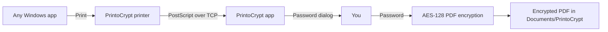

# PrintoCrypt

Virtual Windows printer that saves every print job as a **password-protected PDF**. When you print, PrintoCrypt prompts for a password before writing the file.

## How it works



1. Windows sends the print job to a **virtual PostScript printer** on `127.0.0.1:9150`.
2. The PrintoCrypt tray app receives the job.
3. A **password dialog** appears (print is paused until you confirm or cancel).
4. The job is converted to PDF with **Ghostscript**, then encrypted with **PDFsharp** (128-bit AES, all permissions restricted).
5. The encrypted PDF is saved to your output folder.
6. **Outlook** opens a new email draft with the PDF attached (if installed).

## Requirements

- **Windows 10/11**
- **[.NET 8 Desktop Runtime](https://dotnet.microsoft.com/download/dotnet/8.0)** (if not using self-contained build)
- **[Ghostscript](https://ghostscript.com/releases/gsdnld.html)** (64-bit recommended) — converts PostScript to PDF
- **Microsoft Outlook** (optional) — for attaching encrypted PDFs to a new email after printing

## Build

On Windows with the .NET 8 SDK:

```powershell
dotnet restore PrintoCrypt.sln
dotnet build PrintoCrypt.sln -c Release
dotnet publish src/PrintoCrypt.App/PrintoCrypt.App.csproj -c Release -r win-x64 -o publish
```

Copy the `scripts` folder next to the published executable so in-app installer buttons work.

## Install

### 1. Run PrintoCrypt

Start `PrintoCrypt.exe`. It runs in the system tray and listens for print jobs.

### 2. Install the virtual printer (Administrator)

```powershell
powershell -ExecutionPolicy Bypass -File scripts/Install-Printer.ps1
```

Or use **Settings → Install printer** in the app (elevates automatically).

This registers a printer named **PrintoCrypt** using the Microsoft PostScript class driver, pointed at `127.0.0.1:9150`.

### 3. Install Ghostscript

Download and install Ghostscript. PrintoCrypt auto-detects `gswin64c.exe`. If needed, set the path in **Settings**.

## Usage

1. Keep PrintoCrypt running in the tray.
2. Print from any application and choose **PrintoCrypt**.
3. Enter and confirm a password in the dialog.
4. Find the encrypted PDF in `Documents\PrintoCrypt` (default). Outlook opens with the file attached.

Canceling the dialog discards the print job.

## Settings

Double-click the tray icon or choose **Settings** from the context menu:

| Option | Description |
|--------|-------------|
| Output folder | Where encrypted PDFs are saved |
| Listen port | TCP port for the virtual printer (default `9150`) |
| Ghostscript path | Optional override if auto-detection fails |
| Open Outlook after saving | Compose a new Outlook email with the PDF attached |
| Open output folder after saving | Show the saved file in Explorer |
| Start with Windows | Register PrintoCrypt in the current-user Run key |

## Uninstall

```powershell
powershell -ExecutionPolicy Bypass -File scripts/Uninstall-Printer.ps1
```

Remove PrintoCrypt from startup via Settings, then delete the application folder.

## Security notes

- Passwords are used only in memory for encryption and are not stored.
- PDFs use standard PDF password protection (user + owner password, permissions locked).
- Print data stays on localhost; nothing is sent to the network.
- Choose a strong password; PDF encryption strength depends on the password quality.

## Project structure

```
src/
  PrintoCrypt.Core/     PDF encryption, Ghostscript conversion, settings
  PrintoCrypt.App/      WPF tray app, password dialog, TCP print server
scripts/
  Install-Printer.ps1   Register virtual printer (admin)
  Uninstall-Printer.ps1 Remove virtual printer (admin)
```

## License

MIT
