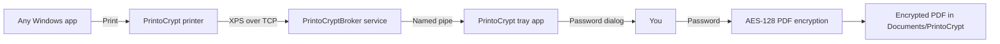

# PrintoCrypt

Virtual Windows printer that saves every print job as a **password-protected PDF**. When you print, PrintoCrypt prompts for a password before writing the file.

**Current version:** 1.0.1 — see [CHANGELOG.md](CHANGELOG.md) for release notes.

## How it works



1. Windows sends the print job to a **virtual XPS printer** on `127.0.0.1:9150`.
2. The **PrintoCryptBroker** Windows service receives the job and routes it to the user who printed.
3. If needed, PrintoCrypt launches the **tray app** in that user's session.
4. A **password dialog** appears (print is paused until you confirm or cancel).
5. The job is converted to PDF with **built-in Windows XPS rendering**, then encrypted with **PDFsharp** (128-bit AES, all permissions restricted).
6. The encrypted PDF is saved to your output folder.
7. **Outlook** opens a new email draft with the PDF attached (if installed).

### Telemetry data
App sends very limited, anonymized telemetry data for usage statistics.
Sent data are:
- timestamp
- public IP
- hostname
- action - install/uninstall/usage (usage is sent on every print)

Purpose of "usage" event is to have better data for active app installations number.

Data are sent as HTTP PUT to analytics server on address: https://analytics.printocrypt.ethercloud.io.

WE DO NOT SHARE ANY OF THIS DATA TO ANYONE.
WE DO NOT COLLECT ANY INFORMATIONS ABOUT ENCRYPTED OR TO BE ECRYPTED DOCUMENTS.

## Requirements

- **Windows 10/11**
- **Microsoft Outlook** (optional) — for attaching encrypted PDFs to a new email after printing

The setup package ships a **self-contained** build (no separate .NET install required). If you use a framework-dependent build instead, the installer will install the .NET 8 Desktop Runtime automatically when needed.

## Build

On Windows with the .NET 8 SDK:

```powershell
dotnet restore PrintoCrypt.sln
dotnet build PrintoCrypt.sln -c Release
dotnet publish src/PrintoCrypt.App/PrintoCrypt.App.csproj -c Release -r win-x64 --self-contained true -o publish
```

Build a setup package:

```powershell
powershell -ExecutionPolicy Bypass -File scripts/Build-Installer.ps1
```

This creates:

- `artifacts/PrintoCrypt-Setup/` — portable setup folder
- `artifacts/PrintoCrypt-Setup.zip` — same content as a zip
- `artifacts/PrintoCrypt-Setup.exe` — GUI installer (requires [Inno Setup 6](https://jrsoftware.org/isinfo.php))

Build the GUI installer locally:

```powershell
winget install --id JRSoftware.InnoSetup --source winget
powershell -ExecutionPolicy Bypass -File scripts/Build-Installer.ps1
```

If `winget` fails on the Microsoft Store source (`msstore` certificate error), always pass `--source winget` as above, or download Inno Setup from https://jrsoftware.org/isdl.php .

Version is read from `Directory.Build.props`.

### Silent install behavior

| Situation | `/VERYSILENT` result |
|-----------|----------------------|
| Not installed | Installs normally |
| Installed, older version | Upgrades in place |
| Installed, same or newer version | Exits immediately (exit code 0), no changes |

```powershell
PrintoCrypt-Setup.exe /VERYSILENT /SUPPRESSMSGBOXES /NORESTART
```

## Install

### GUI installer (recommended)

Run **`PrintoCrypt-Setup.exe`** and follow the wizard.

Progress-only install (no wizard pages):

```powershell
PrintoCrypt-Setup.exe /SILENT
```

Optional custom folder:

```powershell
PrintoCrypt-Setup.exe /VERYSILENT /DIR="C:\Tools\PrintoCrypt"
```

### Portable setup folder

Double-click **`Install.cmd`** in the setup folder (approves UAC once).

Or run as administrator:

```powershell
powershell -ExecutionPolicy Bypass -File Install.ps1
```

Quiet install from PowerShell:

```powershell
powershell -ExecutionPolicy Bypass -File Install.ps1 -Quiet
```

The installer:

- Installs PrintoCrypt to `%ProgramFiles%\PrintoCrypt`
- Registers the **PrintoCrypt** printer for **all users** on the PC
- Installs and starts the **PrintoCryptBroker** Windows service (print capture)
- Registers per-user startup via **Active Setup** so the tray app runs for each user (local and domain)
- Creates Start Menu shortcuts
- Starts the broker service and launches the tray app for the current user

## Uninstall

Double-click **`Uninstall.cmd`**, or run as administrator:

```powershell
powershell -ExecutionPolicy Bypass -File Uninstall.ps1
```

This removes the app, printer, port, broker service, shortcuts, and startup entries.

From the app, **Settings → Install/Uninstall printer** only changes the printer (uses `-PrinterOnly`).

## Usage

1. Keep PrintoCrypt running in the tray.
2. Print from any application and choose **PrintoCrypt**.
3. Enter and confirm a password in the dialog.
4. Find the encrypted PDF in `Documents\PrintoCrypt` (default).

## Settings

| Option | Description |
|--------|-------------|
| Output folder | Where encrypted PDFs are saved |
| Listen port | TCP port for the virtual printer (default `9150`) |
| Open Outlook after saving | Compose a new Outlook email with the PDF attached |
| Open output folder after saving | Show the saved file in Explorer |
| Start with Windows | Register PrintoCrypt in the current user's Run key (via per-user launcher) |

## Project structure

```
src/
  PrintoCrypt.Core/     PDF encryption, settings, job processing
  PrintoCrypt.App/      WPF tray app, broker service, XPS-to-PDF conversion
scripts/
  Build-Installer.ps1   Create setup zip and GUI installer
  Install.ps1           Install app, printer, broker service, and launch
  Uninstall.ps1         Remove everything
installer/
  PrintoCrypt.iss       Inno Setup GUI installer script
Install.cmd             Double-click installer (requests admin)
Uninstall.cmd           Double-click uninstaller (requests admin)
Directory.Build.props   Shared product version
CHANGELOG.md            Release history
```

## License

MIT
